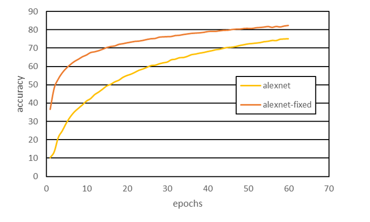
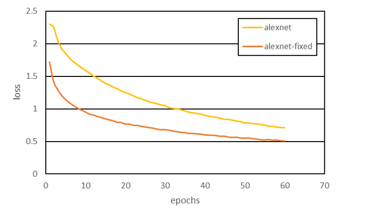

# alexnet-m
このプログラムは，Alexnetの性能を確認するために作ったプログラムです。
また，オリジナルのAlexnetを，Batch NormalizationやLeakyReLUに一部改良したモデルも記載して置きます。

## 動作環境
### <言語>
Python 3.7

### <使用フレームワーク・ライブラリ>
pytorch  
numpy  
time  
matplotlib  
pandas

## 仕様
### 学習
学習には，CIFAR10データセットを利用しています。（pytorchに組み込まれている機能を使用）
training.pyの内部で，オリジナルか修正版のAlexnetを選択することで切り替えることができる。あとは，training.pyを実行するだけで学習がスタートし，すべての学習が終えたら重みパラメータを保存したファイルをsaveフォルダに作成する。

### 評価
validation.pyを実行して，学習した際に作成した重みパラメータを用いて，評価を実施する。

### 考察
Fig.1,Fig.2で比較すると，基本的な構造はBatch NormalizationやLeakyReLUを導入することで，基本的なモデル構造を変えなくてもAlexnetの性能が大きく向上できる。ちなみに，60epochでの計算時間は，通常のalexnetで3983 s，改良したalexnetで4288 sとなっており，多少改良型はフィルタが増えている分時間がかかっている。しかし，同じ精度となるところで比較すると改良型のほうが1/3程度の時間で済んでおり，やはりBatch NormalizationやLeakyReLUは，期待通りの効果を発揮することがわかる。

  

  

### あとがき
最初にDeep learningを学び始めたときに学習したAlexnetを改めて学習し直したが，現在導入されているテクニックを用いるだけでも，大きく性能向上ができるがわかりこの分野での進歩の速さを改めて実感した。